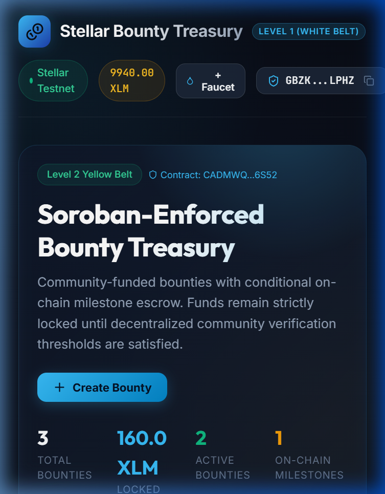
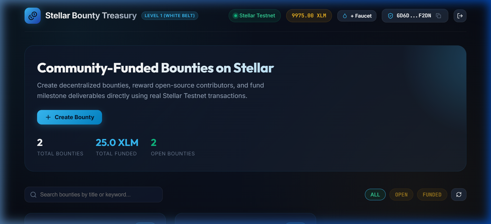
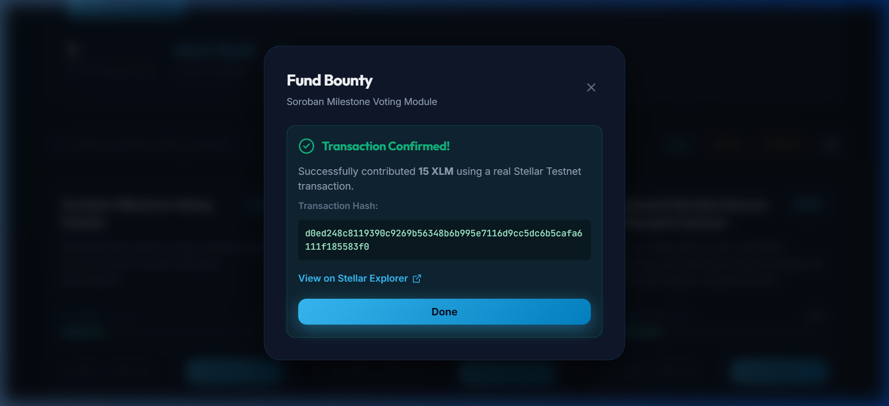
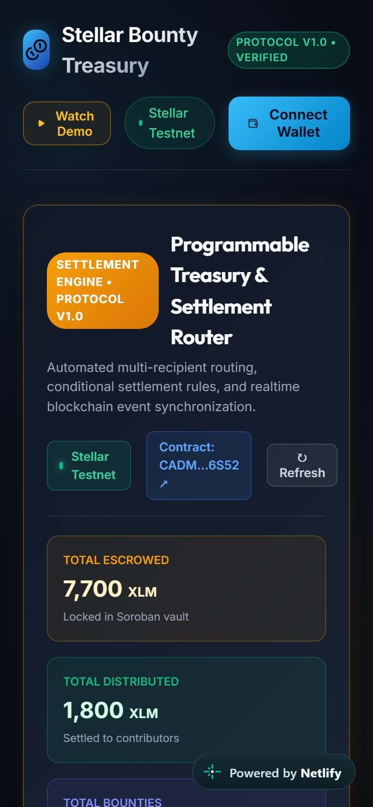

# 🖥️ Stellar Bounty Treasury — Frontend Application

Modern React & TypeScript user interface for **Stellar Bounty Treasury**, demonstrating wallet connection, bounty creation, live XLM balance queries, and real **Stellar Testnet** funding transactions.

---

## 📌 What It Does — Level 2 (Yellow Belt)

At **Level 2**, this application transforms into an interactive on-chain bounty management platform:

> **The contract enforces. The backend observes. The frontend orchestrates.**

```text
Create Bounty
      ↓
Fund Bounty (Locked in Soroban Escrow)
      ↓
Create Milestones
      ↓
Submit Milestone Evidence (GitHub PR / CID)
      ↓
Community Verification (Wallet Signed)
      ↓
Approval Threshold Reached
      ↓
Conditional Payment Release Authorized
      ↓
Contributor Receives XLM
```

* **Authoritative Soroban Escrow**: Funds are locked in contract `CADMWQPCCQP27UHQU4JG3C6V5I3UFNNC4DVOMSK2GUJFA6Q2PNW36S52` on Stellar Testnet.
* **On-Chain Milestone Governance**: Milestones have verifiable delivery evidence references and cryptographic verification thresholds.
* **Wallet-Signed Community Voting**: Reviewers vote Approve/Reject directly with their Stellar wallet signatures; duplicate votes are rejected.
* **Conditional Payment Release**: Settlement buttons remain strictly locked until the approval threshold is satisfied.
* **Contract Activity Feed**: Live feed of indexed Soroban contract events (`bounty_funded`, `milestone_submitted`, `milestone_approved`, `milestone_paid`).

---

## 📸 Level 2 Evidence & Demonstration

### 1. Level 2 On-Chain Bounty Dashboard & Soroban Escrow
The dashboard displays bounties with live milestone progress indicators (`1 / 1 complete`), locked Soroban contract escrow balances, and direct links to the deployed contract on Stellar Expert (`CADMWQPCCQP27UHQU4JG3C6V5I3UFNNC4DVOMSK2GUJFA6Q2PNW36S52`).



### 2. Live Demo Recording: Milestone Voting & Conditional Release
Demonstrating the full Level 2 lifecycle: wallet connection, bounty creation, milestone submission with deliverable PR, multi-wallet community verification, threshold satisfaction, conditional payment unlock, and contract activity indexing.


---

## 📸 Level 1 Foundation Evidence

### 1. Wallet Connected & Live XLM Testnet Balance


### 2. Transaction Confirmed on Stellar Testnet


### 3. Responsive Mobile View


---

## 🚀 How to Run It

### Prerequisites

* Node.js `v20+`
* npm `v10+`
* *(Optional)* [Freighter Wallet](https://www.freighter.app/) extension

### Installation

```bash
npm install
```

### Development Server

```bash
npm run dev
```

Application runs on `http://localhost:3000`.

### Running Unit Tests

```bash
npm test
```

### Production Build

```bash
npm run build
npm run preview
```

---

## ⚙️ Required Environment Variables

Create `.env` based on `.env.example`:

```bash
# Backend API service URL
VITE_API_URL=http://localhost:5000

# Stellar & Soroban Testnet configuration
VITE_STELLAR_NETWORK=TESTNET
VITE_HORIZON_URL=https://horizon-testnet.stellar.org
VITE_SOROBAN_RPC_URL=https://soroban-testnet.stellar.org
VITE_SOROBAN_CONTRACT_ID=CADMWQPCCQP27UHQU4JG3C6V5I3UFNNC4DVOMSK2GUJFA6Q2PNW36S52
VITE_EXPLORER_URL=https://stellar.expert/explorer/testnet/tx
VITE_CONTRACT_EXPLORER_URL=https://stellar.expert/explorer/testnet/contract
```

---

## 👛 How to Connect a Stellar Testnet Wallet

1. Click **"Connect Wallet"** in the top navigation bar or the hero section.
2. Select your preferred method:
   * **Freighter Wallet**: Connect using the official Stellar browser extension. Ensure Freighter network is set to "Testnet".
   * **Instant Testnet Wallet**: Click "Instant Testnet Wallet" to automatically generate a cryptographic keypair and fund it with 10,000 XLM via Friendbot.
   * **Import Secret Key**: Enter an existing Testnet secret key (`S...`) to sign transactions directly.
3. Once connected, your shortened address (`G...`) and live XLM balance from Stellar Testnet Horizon will be displayed in the navbar.
4. You can disconnect at any time using the disconnect button without breaking application state.

---

## 📝 How to Create a Bounty

1. Click **"Create Bounty"** in the hero section or top action bar.
2. Complete the form:
   * **Title**: Descriptive name for the bounty.
   * **Description**: Detailed requirements and deliverable criteria.
   * **Funding Target**: Amount of XLM required.
   * **Creator Address**: Your Stellar Testnet public address (auto-populated if wallet is connected).
3. Click **"Create Bounty"**. The bounty is validated, persisted in the backend database, and immediately displayed on the dashboard.

---

## 💸 How to Fund a Bounty

1. Browse the bounties on the dashboard.
2. Click **"Fund Bounty"** on any open bounty card.
3. Enter your contribution amount (e.g., `15 XLM`) or select a quick preset (`+10`, `+25`, `+50`, `+100`).
4. The application validates your amount against your available balance and checks for network reserve fees.
5. Click **"Sign & Fund Bounty"**.
6. The application constructs a native XLM payment operation, requests your wallet signature, and submits it to Stellar Testnet Horizon.
7. Wait 3–5 seconds for ledger confirmation.
8. Upon confirmation, the modal displays the authentic transaction hash and a direct link to the Stellar Explorer, and the bounty funding progress updates instantly.

---

## 🔍 How to Verify a Transaction

1. In the confirmation modal, click **"View on Stellar Explorer →"**.
2. Alternatively, copy the 64-character transaction hash and navigate to:
   `https://stellar.expert/explorer/testnet/tx/<TRANSACTION_HASH>`
3. Verify on Stellar Expert:
   * **Status**: Successful
   * **Source Account**: Your connected contributor address
   * **Operation**: Payment of native XLM
   * **Destination**: The bounty creator address
   * **Ledger**: Confirmed on live Testnet ledger number

---

## 🔄 How the Repository Will Evolve in Levels 2 and 3

* **Level 2**:
  - Connect to Soroban Escrow Smart Contracts via contract invocations rather than direct peer-to-peer transfers.
  - Add milestone submission forms for bounty claimers.
  - Add community voting and attestation interfaces.
* **Level 3**:
  - Conditional settlement router interface.
  - Multi-recipient milestone distributions.
  - Realtime WebSocket updates for on-chain contract events.

---

## 📄 License

MIT
